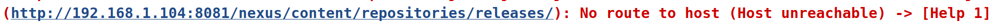

# Upgrade to Jenkins Pipelines

### Getting Started

(You may first want to update all plugins installed on Jenkins)

### Setup New Spring-PetClinic Pipeline in Jenkins

1. Disable existing Jenkins stand alone job
2. If you did not install the Jenkins "Pipeline" and "GitHub" plugins at startup, do now.
3. Select [New Item](http://192.168.33.10:8080/view/all/newJob) option on Jenkins homepage
4. Enter the name "spring.petclinic.pipeline" and select the "Pipeline" job type
5. Select definition "Pipeline script from SCM"
6. Enter the url of your forked spring-petclinic repository
7. Enable "GitHub hook trigger for GITScm polling" to receive push events
8. Save and Run

### Setup Repository Jenkinsfile

1. Copy [demo_build/Jenkinsfile](demo_build/Jenkinsfile) to the root directory of your repository
2. Commit the changes and push to Github
3. Run job again

### First Spring-PetClinic Failure

1. You should see an error in the Jenkins job that includes this output:

2. Update project's [pom.xml](../pom.xml) deployment urls from "192.168.1.104" to "localhost"
3. You can also copy [demo_build/pom.xml](demo_build/pom.xml)
4. Verify address's have been updated and push changes

### Second Spring-Petclinic Failure

1. Jenkins should now automatically kick off the job after your last push!
2.
